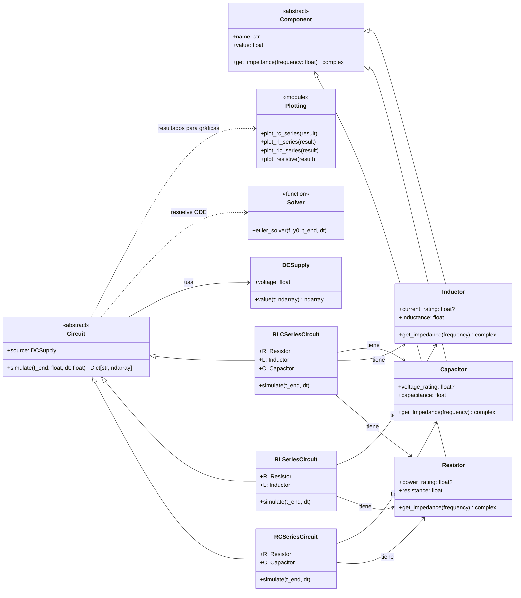

# CircuitSimulator
Simulador de circuitos RC, RL y RLC en Python 

**Alternativa 4 – Simulación de circuitos RC, RL y RLC simples con fuente DC**


El proyecto consiste en desarrollar una aplicación en **Python** que simule circuitos **RC**, **RL** y **RLC** simples con una fuente de tensión DC.  
El programa calculará y mostrará las **gráficas de tensión y corriente** en cada componente del circuito.

La implementación se basa en la programacion orientada a objetos, donde cada componente eléctrico (resistor, capacitor e inductor) es una clase con sus propios atributos físicos y métodos para calcular su comportamiento.

**Objetivos específicos:**
- Aplicar POO para modelar componentes eléctricos básicos.
- Simular el comportamiento transitorio en circuitos RC, RL y RLC en DC.
- Graficar la respuesta temporal de cada componente.
---

##  Diagrama de Clases
## Diagrama de Clases (UML)




### Arquitectura del Proyecto

```
circuit_simulator/
├── components.py    → Define los componentes eléctricos (R, L, C)
├── circuits.py      → Implementa los tipos de circuitos (RC, RL, RLC)
├── sources.py       → Define las fuentes de alimentación
├── solver.py        → Resuelve ecuaciones diferenciales (método de Euler)
└── plotting.py      → Genera gráficas de los resultados
```

### Relaciones entre Clases

**Herencia:**
- `Resistor`, `Capacitor`, `Inductor` ← heredan de `Component`
- `RCSeriesCircuit`, `RLSeriesCircuit`, `RLCSeriesCircuit` ← heredan de `Circuit`

**Composición:**
- `Circuit` **TIENE-UN** `DCSupply`
- `RCSeriesCircuit` **TIENE-UN** `Resistor` y `Capacitor`
- `RLSeriesCircuit` **TIENE-UN** `Resistor` e `Inductor`
- `RLCSeriesCircuit` **TIENE-UN** `Resistor`, `Inductor` y `Capacitor`

**Dependencias:**
- Los circuitos **USAN** `euler_solver` para resolver ecuaciones
- Las funciones de plotting **USAN** los resultados de `simulate()`

### Flujo de Ejecución

1. **Crear componentes** (Resistor, Capacitor, Inductor)
2. **Crear fuente** (DCSupply)
3. **Crear circuito** (RCSeriesCircuit, etc.) pasándole la fuente y componentes
4. **Simular** → `circuit.simulate()` → usa `euler_solver` internamente
5. **Visualizar** → `plot_*_series()` → genera gráficas con matplotlib
---
## ¿Qué es un circuito eléctrico?
Un **circuito eléctrico** es una conexión de componentes que permiten el flujo de corriente para transformar, almacenar o controlar energía.  
Puede incluir resistencias, capacitores, inductores y fuentes, y su comportamiento depende de cómo estos elementos interactúan en el tiempo.


## Tipos de circuitos incluidos en este simulador

Este proyecto trabaja con tres configuraciones clásicas de circuitos eléctricos: **RC**, **RL** y **RLC**. Cada uno combina componentes que almacenan o disipan energía, generando comportamientos dinámicos distintos. A continuación se explica brevemente qué hace cada uno.

### Circuito RC (Resistencia – Capacitor)

Un circuito RC está formado por una resistencia y un capacitor conectados entre sí.  
El capacitor almacena energía en forma de campo eléctrico y se opone a cambios bruscos de voltaje.  
Como resultado, el voltaje en el capacitor no cambia instantáneamente, sino que evoluciona de manera suave y progresiva.  
Este tipo de circuito se usa en temporizadores, filtros y sistemas de suavizado de señales.

### Circuito RL (Resistencia – Inductor)

Un circuito RL combina una resistencia con un inductor (bobina).  
El inductor almacena energía en un campo magnético y se opone a cambios bruscos de corriente.  
Por eso, la corriente en un circuito RL no sube de golpe, sino que aumenta gradualmente hasta estabilizarse.  
Estos circuitos aparecen en motores, electromagnetismo, electrónica de potencia y filtros pasa‑altos.


### Circuito RLC (Resistencia – Inductor – Capacitor)

El circuito RLC integra los tres elementos: resistencia, inductor y capacitor.  
Es el más completo de los tres, ya que puede presentar comportamientos amortiguados u oscilatorios dependiendo de los valores de sus componentes.  
Los circuitos RLC se utilizan en radios, telecomunicaciones, filtros resonantes y sistemas de sintonización de frecuencia.

## ¿Qué hace este simulador?

- Modela componentes eléctricos como **clases independientes**.  
- Construye circuitos combinando objetos.  
- Resuelve ecuaciones diferenciales de **primer orden** (RC, RL) y **segundo orden** (RLC).  
- Genera gráficas comparando:
  - Solución analítica  
  - Simulación numérica  
- Permite modificar parámetros fácilmente para estudiar el comportamiento dinámico.

## Explicación Detallada del Código

### 1. Componentes Eléctricos (`components.py`)

#### Clase Base Abstracta: `Component`

```python
@dataclass
class Component(ABC):
    name: str
    value: float

    @abstractmethod
    def get_impedance(self, frequency: float) -> complex:
        raise NotImplementedError
```

**¿Qué hace?**
- Define la estructura común para todos los componentes
- Obliga a cada componente a implementar el método `get_impedance()`
- Usa `@dataclass` para generar automáticamente `__init__`, `__repr__`, etc.

#### Resistor (Resistencia)

```python
@dataclass
class Resistor(Component):
    power_rating: float | None = None

    @property
    def resistance(self) -> float:
        return self.value

    def get_impedance(self, frequency: float) -> complex:
        return complex(self.resistance, 0.0)
```

**Características:**
- La impedancia es **puramente real**: `Z = R + 0j`
- No depende de la frecuencia
- `power_rating` es opcional y representa la potencia máxima soportada

#### Capacitor (Condensador)

```python
@dataclass
class Capacitor(Component):
    voltage_rating: float | None = None

    @property
    def capacitance(self) -> float:
        return self.value

    def get_impedance(self, frequency: float) -> complex:
        if frequency == 0:
            return complex(float("inf"))
        omega = 2 * math.pi * frequency
        return 1 / (1j * omega * self.capacitance)
```

**Características:**
- La impedancia es **imaginaria negativa**: `Z_C = 1/(jωC)`
- A frecuencia cero (DC), la impedancia es infinita (circuito abierto)
- Almacena energía en forma de campo eléctrico

#### Inductor (Bobina)

```python
@dataclass
class Inductor(Component):
    current_rating: float | None = None

    @property
    def inductance(self) -> float:
        return self.value

    def get_impedance(self, frequency: float) -> complex:
        omega = 2 * math.pi * frequency
        return 1j * omega * self.inductance
```

**Características:**
- La impedancia es **imaginaria positiva**: `Z_L = jωL`
- A frecuencia cero (DC), la impedancia es cero (cortocircuito)
- Almacena energía en forma de campo magnético

---

### 2. Fuente de Alimentación (`sources.py`)

```python
@dataclass
class DCSupply:
    voltage: float

    def value(self, t: np.ndarray) -> np.ndarray:
        return self.voltage * np.ones_like(t)
```

**¿Qué hace?**
- Representa una fuente de voltaje DC constante
- El método `value()` retorna un array con el mismo voltaje para todos los instantes de tiempo
- Ejemplo: `DCSupply(5.0)` → fuente de 5 voltios

---

### 3. Circuitos (`circuits.py`)

#### Clase Base: `Circuit`

```python
@dataclass
class Circuit(ABC):
    source: DCSupply

    @abstractmethod
    def simulate(self, t_end: float, dt: float) -> Dict[str, np.ndarray]:
        ...
```

Define el contrato que todos los circuitos deben cumplir: tener una fuente e implementar `simulate()`.

#### Circuito RC Serie

```python
@dataclass
class RCSeriesCircuit(Circuit):
    R: Resistor
    C: Capacitor

    def simulate(self, t_end: float, dt: float) -> Dict[str, np.ndarray]:
        V = self.source.voltage
        R = self.R.resistance
        C = self.C.capacitance

        # Ecuación diferencial: dv_c/dt = (V - v_c)/(RC)
        def f(t, state):
            v_c = state[0]
            dv_dt = (V - v_c) / (R * C)
            return np.array([dv_dt])

        t, y = euler_solver(f, np.array([0.0]), t_end, dt)
        v_c = y[:, 0]
        i = (V - v_c) / R
        v_r = V - v_c

        return {"t": t, "i": i, "v_R": v_r, "v_C": v_c}
```

**Ecuación física:**
```
τ = RC  (constante de tiempo)
dv_c/dt = (V - v_c) / τ
```

**Comportamiento:**
- El capacitor se carga exponencialmente desde 0V hasta V
- La corriente disminuye exponencialmente desde V/R hasta 0

#### Circuito RL Serie

```python
@dataclass
class RLSeriesCircuit(Circuit):
    R: Resistor
    L: Inductor

    def simulate(self, t_end: float, dt: float) -> Dict[str, np.ndarray]:
        V = self.source.voltage
        R = self.R.resistance
        L = self.L.inductance

        def f(t, state):
            i = state[0]
            di_dt = (V - R * i) / L
            return np.array([di_dt])

        t, y = euler_solver(f, np.array([0.0]), t_end, dt)
        i = y[:, 0]
        v_r = R * i
        v_l = V - v_r

        return {"t": t, "i": i, "v_R": v_r, "v_L": v_l}
```

**Ecuación física:**
```
τ = L/R  (constante de tiempo)
di/dt = (V - Ri) / L
```

**Comportamiento:**
- La corriente crece exponencialmente desde 0A hasta V/R
- El voltaje en el inductor disminuye desde V hasta 0

#### Circuito RLC Serie

```python
@dataclass
class RLCSeriesCircuit(Circuit):
    R: Resistor
    L: Inductor
    C: Capacitor

    def simulate(self, t_end: float, dt: float) -> Dict[str, np.ndarray]:
        V = self.source.voltage
        R = self.R.resistance
        L = self.L.inductance
        C = self.C.capacitance

        def f(t, state):
            i, v_c = state
            di_dt = (V - R * i - v_c) / L
            dv_dt = i / C
            return np.array([di_dt, dv_dt])

        t, y = euler_solver(f, np.array([0.0, 0.0]), t_end, dt)
        i = y[:, 0]
        v_c = y[:, 1]
        v_r = R * i
        v_l = V - v_r - v_c

        return {"t": t, "i": i, "v_R": v_r, "v_L": v_l, "v_C": v_c}
```

**Sistema de ecuaciones:**
```
di/dt = (V - Ri - v_c) / L
dv_c/dt = i / C
```

**Comportamiento:**
- Puede ser **sobreamortiguado**, **críticamente amortiguado** u **oscilatorio**
- Depende del factor de amortiguamiento: `ζ = R/(2√(L/C))`

---

### 4. Solver Numérico (`solver.py`)

```python
def euler_solver(f: Callable[[float, np.ndarray], np.ndarray],
                 y0: np.ndarray,
                 t_end: float,
                 dt: float) -> Tuple[np.ndarray, np.ndarray]:
    
    n_steps = int(t_end / dt) + 1
    t = np.linspace(0, t_end, n_steps)
    y = np.zeros((n_steps, len(y0)), dtype=float)
    y[0, :] = y0

    for k in range(n_steps - 1):
        dy = f(t[k], y[k, :])
        y[k + 1, :] = y[k, :] + dt * dy

    return t, y
```

**¿Cómo funciona?**

El método de Euler aproxima la solución de ecuaciones diferenciales:
```
y(t + dt) ≈ y(t) + dt × f(t, y)
```

**Parámetros:**
- `f`: ecuación diferencial `dy/dt = f(t, y)`
- `y0`: condiciones iniciales (estado en t=0)
- `t_end`: tiempo final de simulación
- `dt`: paso de tiempo (más pequeño = más preciso)

**Retorna:**
- `t`: vector de tiempos `[0, dt, 2dt, ..., t_end]`
- `y`: solución del sistema en cada instante

---

### 5. Ejemplo de Uso Completo

```python
from circuit_simulator.components import Resistor, Capacitor
from circuit_simulator.sources import DCSupply
from circuit_simulator.circuits import RCSeriesCircuit
from circuit_simulator.plotting import plot_rc_series
import matplotlib.pyplot as plt

# 1. Crear la fuente de alimentación
source = DCSupply(5.0)  # 5 voltios DC

# 2. Crear los componentes
R = Resistor("R1", 1000)      # 1kΩ
C = Capacitor("C1", 100e-6)   # 100μF

# 3. Construir el circuito
circuit = RCSeriesCircuit(source, R, C)

# 4. Simular durante 0.5 segundos
result = circuit.simulate(t_end=0.5, dt=1e-4)

# 5. Visualizar resultados
plot_rc_series(result)
plt.show()
```

**El método `simulate()` retorna:**
```python
{
    "t": array([0.0000, 0.0001, 0.0002, ...]),  # Tiempo
    "i": array([...]),                          # Corriente
    "v_R": array([...]),                        # Voltaje en resistor
    "v_C": array([...])                         # Voltaje en capacitor
}
```

---

### Principios de Diseño Aplicados

1. **Abstracción**: Clases abstractas `Component` y `Circuit` definen interfaces comunes
2. **Herencia**: Componentes y circuitos heredan de sus clases base
3. **Composición**: Los circuitos **tienen** componentes (relación HAS-A)
4. **Polimorfismo**: Cada clase implementa métodos de forma específica
5. **Responsabilidad Única**: Cada módulo tiene una función bien definida

---

### Fundamentos Matemáticos

#### Constantes de Tiempo

**Circuito RC:** `τ = RC`  
**Circuito RL:** `τ = L/R`

La constante de tiempo indica cuánto tarda el circuito en alcanzar ~63.2% de su valor final.

#### Ecuaciones Diferenciales

**RC Serie:**
```
V = v_R + v_C
i = C(dv_c/dt)
→ dv_c/dt = (V - v_c)/(RC)
```

**RL Serie:**
```
V = v_R + v_L
V = Ri + L(di/dt)
→ di/dt = (V - Ri)/L
```

**RLC Serie:**
```
V = v_R + v_L + v_C
→ di/dt = (V - Ri - v_c)/L
→ dv_c/dt = i/C
```

