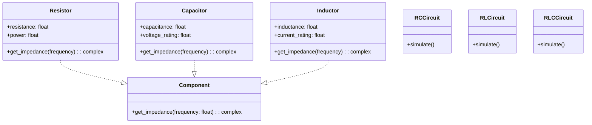

# CircuitSimulator
Simulador de circuitos RC, RL y RLC en Python 

**Alternativa 4 – Simulación de circuitos RC, RL y RLC simples con fuente DC**


El proyecto consiste en desarrollar una aplicación en **Python** que simule circuitos **RC**, **RL** y **RLC** simples con una **fuente de tensión DC.  
El programa calculará y mostrará las **gráficas de tensión y corriente** en cada componente del circuito.

La implementación se basa en la programacion orientada a objetos, donde cada componente eléctrico (resistor, capacitor e inductor) es una clase con sus propios atributos físicos y métodos para calcular su comportamiento.

**Objetivos específicos:**
- Aplicar POO para modelar componentes eléctricos básicos.
- Simular el comportamiento transitorio en circuitos RC, RL y RLC en DC.
- Graficar la respuesta temporal de cada componente.
---

##  Diagrama de clases


---

##  Solución preliminar

Para demostrar el funcionamiento básico del simulador, se creó un código en Python que implementa las clases de los componentes eléctricos (R, C, L) y permite simular los circuitos **RC**, **RL** y **RLC** simples con una fuente DC tipo escalón.  
Este código aplica principios de POO y genera las gráficas de tensión y corriente de cada componente.

### Código preliminar (ejecutable)

```python
# prelim_sim.py 
# Librerías necesarias: numpy, scipy, matplotlib
from dataclasses import dataclass
import numpy as np
from scipy.integrate import solve_ivp
import matplotlib.pyplot as plt

@dataclass
class Resistor:
    resistance: float
    def impedance(self, f: float = 0): return complex(self.resistance, 0)

@dataclass
class Capacitor:
    capacitance: float
    def impedance(self, f: float): return complex(float('inf'), 0) if f == 0 else 1/(1j*2*np.pi*f*self.capacitance)

@dataclass
class Inductor:
    inductance: float
    def impedance(self, f: float): return 1j*2*np.pi*f*self.inductance

# Circuito RC
def simulate_RC(R, C, V_in, t_end=0.02):
    def f(t, vC): return (V_in - vC[0]) / (R * C)
    t = np.linspace(0, t_end, 2001)
    sol = solve_ivp(lambda t, y: [f(t, y)], (0, t_end), [0.0], t_eval=t)
    vC = sol.y[0]
    i = (V_in - vC) / R
    plt.plot(t, vC, label='vC(t)')
    plt.plot(t, i, label='i(t)')
    plt.title('Respuesta transitoria RC')
    plt.xlabel('Tiempo [s]')
    plt.ylabel('Magnitud (V o A)')
    plt.legend(); plt.grid(); plt.show()

# Ejemplo de uso:
simulate_RC(R=1000, C=1e-6, V_in=5)
```

## PREGUNTAS
1.¿Está bien la forma en la que se usan las clases Resistor, Capacitor e Inductor o debería agruparlas bajo una clase base como Componente?

2.¿Conviene implementar herencia entre los diferentes componentes eléctricos o mantener las clases separadas?

3.¿Es bueno que el circuito completo (por ejemplo, CircuitoRC o CircuitoRLC) sea una clase con sus propios métodos de simulación?

4.¿solve_ivp es la mejor herramienta para resolver ecuaciones diferenciales o hay alguna quer puede ser mejor?
