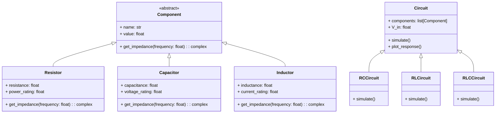

# CircuitSimulator
Simulador de circuitos RC, RL y RLC en Python 

**Alternativa 4 – Simulación de circuitos RC, RL y RLC simples con fuente DC**

El proyecto consiste en desarrollar una aplicación en **Python** que simule circuitos **RC**, **RL** y **RLC** simples con una fuente de tensión DC.  
El programa calculará y mostrará las **gráficas de tensión y corriente** en cada componente del circuito.

La implementación se basa en la programacion orientada a objetos, donde cada componente eléctrico (resistor, capacitor e inductor) es una clase con sus propios atributos físicos y métodos para calcular su comportamiento.

**Objetivos específicos:**
- Aplicar POO para modelar componentes eléctricos básicos.
- Simular el comportamiento transitorio en circuitos RC, RL y RLC en DC.
- Graficar la respuesta temporal de cada componente.
---

##  Diagrama de clases

---
## ¿Qué es un circuito eléctrico?
Un **circuito eléctrico** es una conexión de componentes que permiten el flujo de corriente para transformar, almacenar o controlar energía.  
Puede incluir resistencias, capacitores, inductores y fuentes, y su comportamiento depende de cómo estos elementos interactúan en el tiempo.

## Tipos de circuitos incluidos en este simulador

Este proyecto trabaja con tres configuraciones clásicas de circuitos eléctricos: **RC**, **RL** y **RLC**. Cada uno combina componentes que almacenan o disipan energía, generando comportamientos dinámicos distintos. A continuación se explica brevemente qué hace cada uno.

### Circuito RC (Resistencia – Capacitor)

Un circuito RC está formado por una resistencia y un capacitor conectados entre sí.  
El capacitor almacena energía en forma de campo eléctrico y se opone a cambios bruscos de voltaje.  
Como resultado, el voltaje en el capacitor no cambia instantáneamente, sino que evoluciona de manera suave y progresiva.  
Este tipo de circuito se usa en temporizadores, filtros y sistemas de suavizado de señales.

### Circuito RL (Resistencia – Inductor)

Un circuito RL combina una resistencia con un inductor (bobina).  
El inductor almacena energía en un campo magnético y se opone a cambios bruscos de corriente.  
Por eso, la corriente en un circuito RL no sube de golpe, sino que aumenta gradualmente hasta estabilizarse.  
Estos circuitos aparecen en motores, electromagnetismo, electrónica de potencia y filtros pasa‑altos.

### Circuito RLC (Resistencia – Inductor – Capacitor)

El circuito RLC integra los tres elementos: resistencia, inductor y capacitor.  
Es el más completo de los tres, ya que puede presentar comportamientos amortiguados u oscilatorios dependiendo de los valores de sus componentes.  
Los circuitos RLC se utilizan en radios, telecomunicaciones, filtros resonantes y sistemas de sintonización de frecuencia.

## ¿Qué hace este simulador?

- Modela componentes eléctricos como **clases independientes**.  
- Construye circuitos combinando objetos.  
- Resuelve ecuaciones diferenciales de **primer orden** (RC, RL) y **segundo orden** (RLC).  
- Genera gráficas comparando:
  - Solución analítica  
  - Simulación numérica  
- Permite modificar parámetros fácilmente para estudiar el comportamiento dinámico.

## Cómo funciona el código del simulador

El proyecto está dividido en módulos pequeños y claros, cada uno encargado de una parte específica del simulador. Esto hace que el código sea fácil de mantener, extender y entender.

### `components.py` — Componentes eléctricos
Define las clases básicas del simulador:
- Resistor  
- Capacitor  
- Inductor  

Cada componente almacena su valor (R, C o L) y puede calcular su impedancia según la frecuencia.  
Estos objetos se usan para construir los circuitos.

### `circuits.py` — Modelos de circuitos
Contiene las clases que representan los circuitos en serie:
- `RCSeriesCircuit`  
- `RLSeriesCircuit`  
- `RLCSeriesCircuit`  

Cada clase implementa un método `simulate()` que:
1. Define la ecuación diferencial del circuito.  
2. Llama al solver numérico.  
3. Devuelve tiempo, corriente y voltajes en cada componente.

### `solver.py` — Método numérico
Implementa un solver de Euler simple.  
Recibe:
- La función diferencial del circuito  
- El estado inicial  
- El tiempo total y el paso `dt`  

Devuelve:
- Vector de tiempo  
- Evolución de las variables del circuito  

Es el motor matemático del simulador.

### `sources.py` — Fuente de voltaje
Define la clase `DCSupply`, que representa una fuente de voltaje constante.  
Entrega un vector con el mismo voltaje para toda la simulación.

### `plotting.py` — Gráficas
Incluye funciones para graficar:
- Voltajes en cada componente  
- Corriente del circuito  

Cada tipo de circuito tiene su función dedicada (`plot_rc_series`, `plot_rl_series`, etc.).
